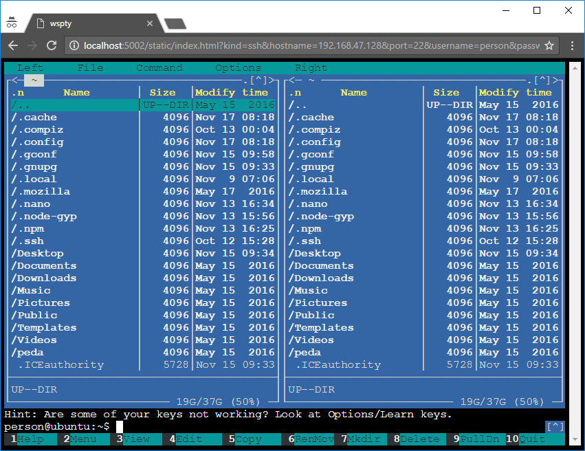

# websocket_terminal

A cross-platform python3 server that bridges either ssh or raw tcp to the browser via websocket. 

# Quickstart


### 1. Clone and start

```
git clone https://github.com/sorgloomer/websocket_terminal.git
pip3 install -r requirements.txt
python3 websocket_terminal.py
```

### 2. Navigate browser

Open one of the following links in a browser:

Local ssh:

```
http://localhost:5002?kind=ssh&username=<username>&password=<password>
```

Remote ssh:

```
http://localhost:5002?kind=ssh&username=<username>&password=<password>&hostname=<ssh_hostname>
```

### 3. Enjoy



# Remarks

Currently only password authentication is supported for ssh. The username and password is sent in plaintext via **http or https** in the default implementation!

# Credits

Thanks to aluzzardi for the wssh project, which inspired this one. The websocket and json based protocol is entirely the same as in wssh.

Greenlet and wsgi implementation: eventlet

Python ssh client: paramiko

Browser side terminal: xterm.js
